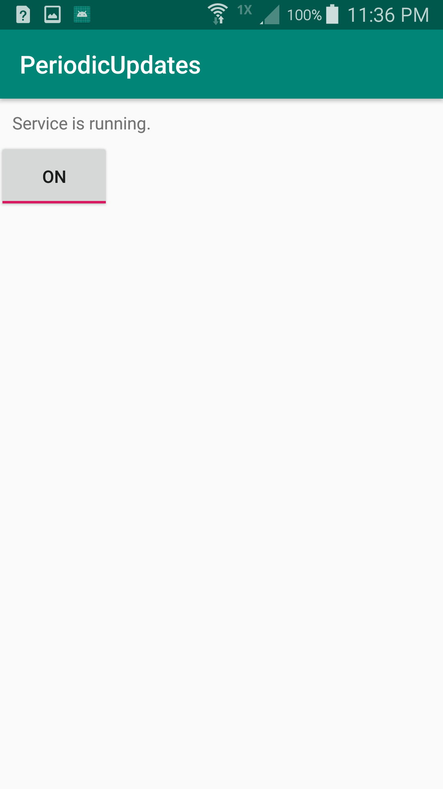
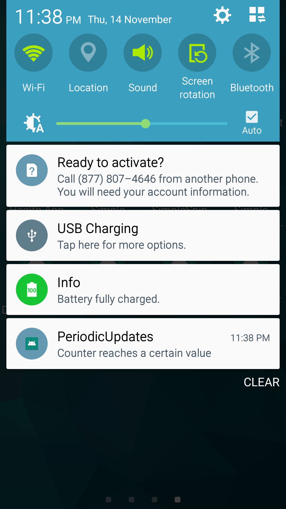

# PeriodicUpdates
A basic Android project to demonstrate the use of Service, BroadcastReceiver and Notification

This project consists of four classes:

### MainActivity
The MainActivity controls the setting of the sensor service. If the setting is ON, the service starts (or stay running). If the setting is OFF, the service is stopped. The setting is saved as a SharedPreference so that it is retrievable even when the activity no longer exists.

### SensorService
The SensorService currently hosts an integer counter that is periodically incremented (using a TimerTask) as long as the sensor is running. If the service is killed, the service broadcasts a request for restart. While the service is running, it broadcasts a request to alert the user whenever the counter meets a certain condition (such as divisible by some number). For practical use, the integer counter may be replaced by some useful task such as to check the ambient temperature.

### AlertReceiver
This receiver catches any alert broadcast from the SensorService. When such an alert is received, a notification is sent out.

### RestartReceiver
This receiver catches any restart broadcast from the SensorService. When such an alert is received, this receiver verify the setting in the SharedPreference. If the setting is ON, the service is restarted. Otherwise, the request is ignored. 

## Screenshots

 
